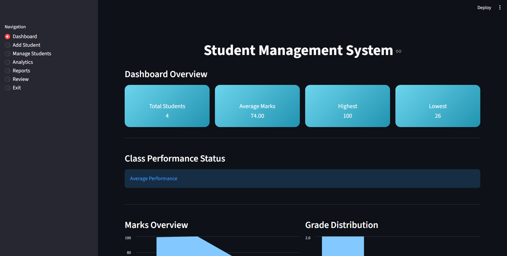
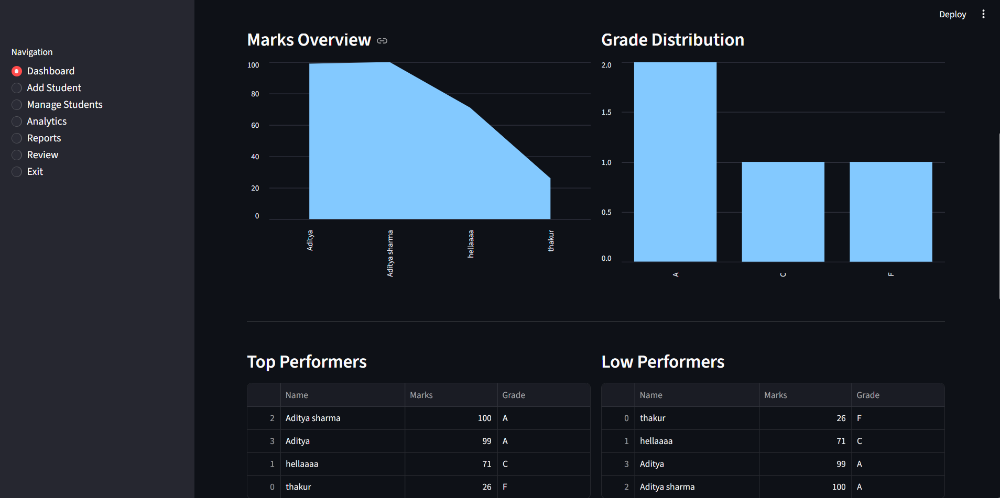
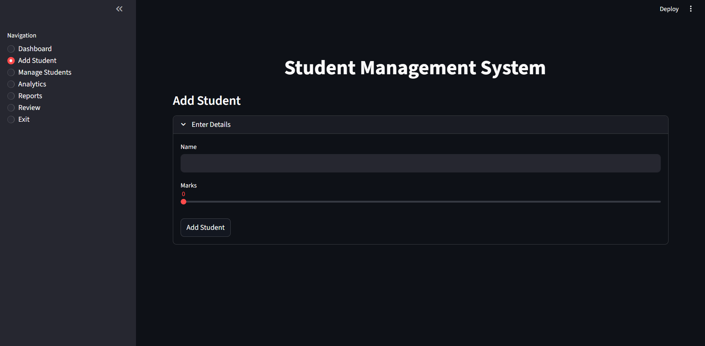
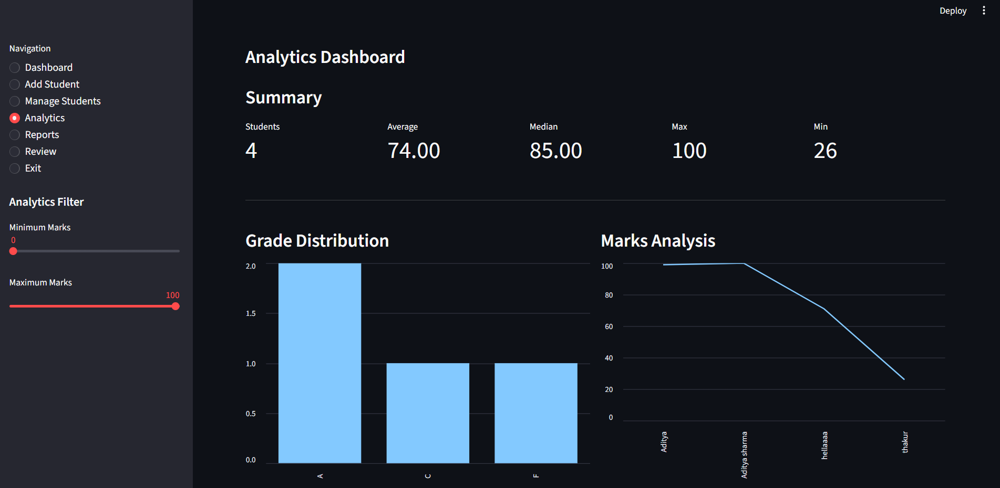
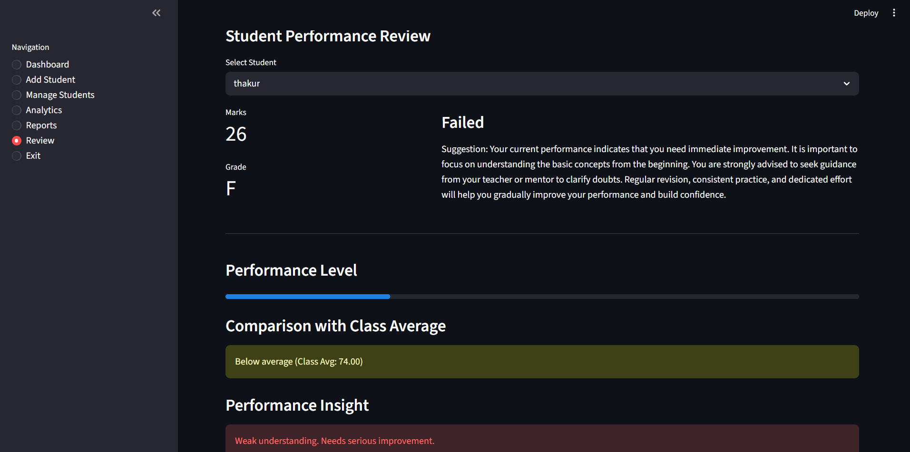

# Student Performance Analytics & Management System

A modern **Student Management and Performance Analytics Platform** built using **Python**, **Streamlit**, **SQLite**, and **Plotly**. The application enables educational institutions to efficiently manage student records while providing interactive dashboards and analytical reports for monitoring academic performance.

---

## Project Overview

The Student Performance Analytics & Management System is a comprehensive web application designed to simplify student data management and provide meaningful insights into academic performance.

The application combines CRUD operations with interactive dashboards, enabling administrators to monitor student records, analyze performance trends, generate reports, and make data-driven academic decisions.

---

# Features

## Dashboard

- Student Performance Overview
- KPI Cards
- Total Students
- Average Marks
- Highest Marks
- Lowest Marks
- Performance Summary

---

## Student Management

- Add New Student
- Update Student Records
- Delete Student Records
- Manage Student Information
- Search Student Records

---

## Analytics

- Marks Distribution
- Grade Distribution
- Average Performance
- Student Comparison
- Academic Insights
- Interactive Charts

---

## Reports

- Student Performance Report
- Grade Analysis
- Overall Class Performance
- Academic Summary
- Download Reports

---

## Review Module

- Review Student Information
- Academic Record Verification
- Performance Evaluation

---

## User Interface

- Modern Dashboard
- Responsive Design
- Interactive Sidebar Navigation
- KPI Cards
- Dark Theme
- Professional Layout

---

# 🛠 Tech Stack

| Category | Technology |
|-----------|------------|
| Language | Python |
| Framework | Streamlit |
| Database | SQLite |
| Data Processing | Pandas |
| Visualization | Plotly / Streamlit Charts |
| Styling | HTML + CSS |

---

# Project Structure

```
Student-Performance-Analytics-System/

│
├── app.py
├── database.py
├── requirements.txt
├── README.md
│
├── pages/
│   ├── Dashboard.py
│   ├── Add_Student.py
│   ├── Manage_Students.py
│   ├── Analytics.py
│   ├── Reports.py
│   └── Review.py
│
├── database/
│
├── assets/
│
└── screenshots/
```

---

# Dashboard Modules

- Dashboard
- Add Student
- Manage Students
- Analytics
- Reports
- Review

---

# Analytics Included

- Student Performance Summary
- Marks Distribution
- Grade Distribution
- Average Marks Analysis
- Highest & Lowest Score Analysis
- Overall Class Performance
- Student Comparison

---

# Application Preview








---

# Installation

Clone the repository

```bash
git clone https://github.com/yourusername/student-performance-analytics-system.git
```

Navigate to the project directory

```bash
cd student-performance-analytics-system
```

Install dependencies

```bash
pip install -r requirements.txt
```

Run the application

```bash
streamlit run app.py
```

---

# Functionalities

✔ Add Student

✔ Update Student Information

✔ Delete Student

✔ Search Students

✔ Dashboard Overview

✔ Student Analytics

✔ Reports Generation

✔ Grade Distribution

✔ Marks Visualization

✔ Academic Performance Monitoring

---

# Future Enhancements

- Student Login System
- Faculty Login
- Attendance Management
- Subject-wise Analysis
- GPA Calculator
- Performance Prediction using Machine Learning
- Email Notifications
- PDF Report Generation
- Excel Export
- Cloud Database Integration
- Role-Based Authentication

---

# Resume Highlights

- Developed a full-stack Student Performance Analytics application using Python and Streamlit.
- Implemented CRUD operations for efficient student record management with SQLite integration.
- Built interactive dashboards featuring KPI cards, performance metrics, and academic visualizations.
- Designed analytical reports to evaluate student performance through grade distribution and marks analysis.
- Created a responsive user interface with sidebar navigation, charts, and data-driven insights for academic decision-making.

---

# Skills Demonstrated

- Python Programming
- Streamlit Development
- SQLite Database
- CRUD Operations
- Data Visualization
- Dashboard Development
- Data Analysis
- Educational Analytics
- UI Design
- Data Management

---

# Author

**Aditya Sharma**

If you found this project useful, consider giving it a ⭐ on GitHub.## Student Data Analysis and Performance Dashboard

